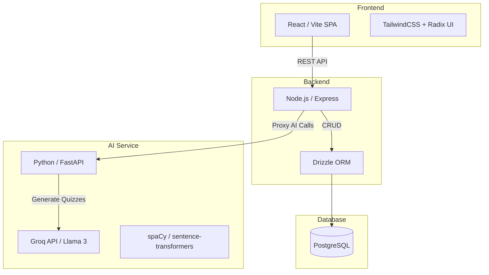
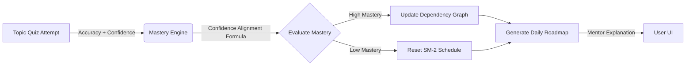

# MentorAI 🧠

**MentorAI** is a production-ready, adaptive AI Learning Operating System. It automatically generates personalized learning roadmaps, assesses your resume, generates AI quizzes using Groq LLMs, and uses an intelligent spaced repetition engine to adapt to your learning velocity.

---

## Architecture Overview

MentorAI utilizes a modern decoupled microservices architecture optimized for rapid iteration and AI integration:

### Stack Details
- **Frontend**: React 18, React Router 6 (SPA), TailwindCSS 3, TypeScript.
- **Backend Core**: Express.js proxying requests and serving Drizzle ORM models.
- **AI Backend**: Python 3.11 FastAPI service handling text-embeddings, resume parsing (`pdfplumber`), and LLM calls via the `groq` SDK.
- **Database**: PostgreSQL with standard relational schema (`users`, `topic_mastery`, `review_schedule`).

---

## The Adaptive Intelligence Flow

The core feature of MentorAI is the **Metacognitive Adaptive Loop**. Learning isn't just about reading; it's about validating understanding and intelligently scheduling reviews based on confidence.

### 1. Confidence Alignment Formula
Your `topic_mastery` is not just calculated by right/wrong answers. We integrate metacognitive self-reporting:
- High Accuracy + High Confidence = **Strong Mastery**
- Low Accuracy + High Confidence = **Misconception Danger** (Penalized!)
- High Accuracy + Low Confidence = **Uncertain Understanding**

### 2. SuperMemo-2 (SM-2) Spaced Repetition
When a quiz is passed, the `review_schedule` table recalculates your `easeFactor`. The interval stretches exponentially (1 day → 6 days → 15 days). If you fail, the interval resets, automatically injecting a review into your daily roadmap.

### 3. Dependency Graph Logic
Roadmap tasks define prerequisite dependencies in a `jsonb` array. If your mastery of a prerequisite (e.g. "Recursion") drops below 50%, dependent topics (e.g. "Trees") enter a **Locked** or **Guided** learning state, preventing you from advancing until foundations are restored.

---

## Behavioral Loop & Analytics

MentorAI continuously watches for burnout and pacing tolerance via `server/routes/analytics.ts`. 

- **Drop-off Detection**: Identifies topics where you score poorly and skip subsequent tasks.
- **Dynamic Weekly Reviews**: Algorithmically generates a personalized paragraph offering encouragement and suggesting pacing adjustments.
- **Mentor Memory**: Stores contextual profile insights in `mentor_memory` for the AI to retain conversational consistency across sessions.

---

## Future Roadmap (Phase 7 & 8)

- **Vector Search (`pgvector`)**: Converting resources, weak areas, and user resumes into semantic embeddings to natively query the closest learning resources using Drizzle.
- **Learning Style Detection**: Tracking the ratio of videos vs. articles consumed to automatically filter the roadmap.
- **Async Workers**: Moving AI generation and embedding calculations to Redis/BullMQ to prevent blocking Express endpoints.
