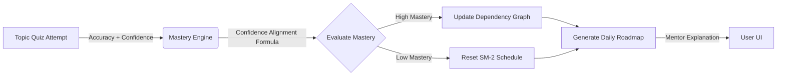

# MentorAI 🧠

**MentorAI** is a production-ready, adaptive AI Learning Operating System. It automatically generates personalized learning roadmaps, assesses your resume, generates AI quizzes using Groq LLMs, and uses an intelligent spaced repetition engine to adapt to your learning velocity.

---

## Architecture & Infrastructure

MentorAI utilizes a modern decoupled microservices architecture:

- **Frontend**: React 18 SPA (Vite) + TailwindCSS + Radix UI.
- **Backend Core**: Express.js with **BullMQ** for async job processing.
- **AI Backend**: Python 3.11 FastAPI service for embeddings (`all-MiniLM-L6-v2`) and resume parsing.
- **Database**: PostgreSQL with **pgvector** for semantic ranking and Drizzle ORM.

---

## Completed Phases (v1.0 Ready)

### ✅ Phase 7: Semantic Intelligence & pgvector
- **Vector Search**: Integrated `pgvector` for 384-dim semantic embeddings.
- **Semantic Ranking**: Roadmap resources are now ranked using cosine distance + quality scores.
- **Learning Style Tracking**: Monitoring format preferences and session length to detect burnout.

### ✅ Phase 8: Async Workers & BullMQ
- **Background Jobs**: Offloaded heavy NLP and analytics tasks to BullMQ.
- **Resilient Infrastructure**: Lazy-loading Redis connections to ensure the server remains stable even if infrastructure is offline.
- **Health Monitoring**: Real-time queue health dashboard.

---

## Quick Start

### 1. Environment Setup
Copy `.env.example` to `.env` and fill in:
- `DATABASE_URL`: Your PostgreSQL connection string.
- `REDIS_URL`: (Optional) Redis URI to enable background workers.
- `GROQ_API_KEY`: Required for AI Quiz generation.

### 2. Start Python AI Service
```bash
cd python_service
pip install -r requirements.txt
python main.py
```

### 3. Initialize Database
```bash
pnpm drizzle-kit push
pnpm tsx server/seed_resources.ts
```

### 4. Start Development Server
```bash
pnpm dev
```

---

## The Adaptive Intelligence Flow

The core feature of MentorAI is the **Metacognitive Adaptive Loop**. Learning isn't just about reading; it's about validating understanding and intelligently scheduling reviews based on confidence.



### 1. Confidence Alignment Formula
Your `topic_mastery` is not just calculated by right/wrong answers. We integrate metacognitive self-reporting:
- High Accuracy + High Confidence = **Strong Mastery**
- Low Accuracy + High Confidence = **Misconception Danger** (Penalized!)
- High Accuracy + Low Confidence = **Uncertain Understanding**

### 2. SuperMemo-2 (SM-2) Spaced Repetition
When a quiz is passed, the `review_schedule` table recalculates your `easeFactor`. The interval stretches exponentially (1 day → 6 days → 15 days). If you fail, the interval resets, automatically injecting a review into your daily roadmap.

### 3. Dependency Graph Logic
Roadmap tasks define prerequisite dependencies in a `jsonb` array. If your mastery of a prerequisite (e.g. "Recursion") drops below 50%, dependent topics (e.g. "Trees") enter a **Locked** or **Guided** learning state, preventing you from advancing until foundations are restored.

---

## Behavioral Loop & Analytics

MentorAI continuously watches for burnout and pacing tolerance via `server/routes/analytics.ts`. 

- **Drop-off Detection**: Identifies topics where you score poorly and skip subsequent tasks.
- **Dynamic Weekly Reviews**: Algorithmically generates a personalized paragraph offering encouragement and suggesting pacing adjustments.
- **Mentor Memory**: Stores contextual profile insights in `mentor_memory` for the AI to retain conversational consistency across sessions.
